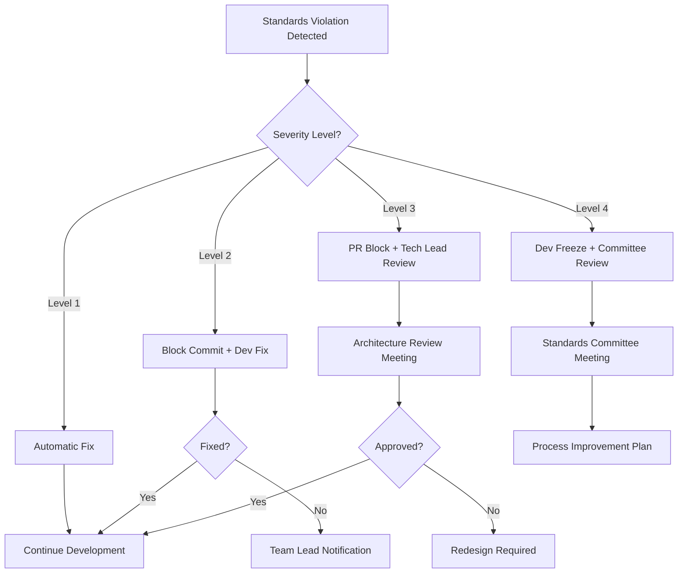

# SoapBox Development Standards - Enforcement Methods

**Document Version:** 1.0  
**Effective Date:** July 23, 2025  
**Scope:** All SoapBox Super App Development  
**Authority:** Technical Governance Board  

---

## Table of Contents

1. [Overview](#overview)
2. [Automated Enforcement](#automated-enforcement)
3. [Manual Enforcement](#manual-enforcement)
4. [Development Workflow Integration](#development-workflow-integration)
5. [Monitoring and Metrics](#monitoring-and-metrics)
6. [Escalation Procedures](#escalation-procedures)
7. [Training and Support](#training-and-support)

---

## Overview

This document defines the enforcement mechanisms for SoapBox Development Standards, ensuring consistent code quality, naming conventions, and architectural patterns across the entire development team.

### Enforcement Philosophy
- **Automated where possible** - Reduce human error and cognitive load
- **Educative not punitive** - Help developers learn and improve
- **Integrated into workflow** - Seamless part of development process
- **Measurable outcomes** - Track compliance and improvement over time

---

## Automated Enforcement

### 1. ESLint Configuration (REQUIRED)

#### Installation and Setup
```bash
# Install ESLint and required plugins
npm install --save-dev eslint @typescript-eslint/parser @typescript-eslint/eslint-plugin
npm install --save-dev eslint-plugin-react eslint-plugin-react-hooks
npm install --save-dev @tanstack/eslint-plugin-query
```

#### .eslintrc.json Configuration
```json
{
  "parser": "@typescript-eslint/parser",
  "parserOptions": {
    "ecmaVersion": 2022,
    "sourceType": "module",
    "ecmaFeatures": {
      "jsx": true
    }
  },
  "extends": [
    "eslint:recommended",
    "@typescript-eslint/recommended",
    "plugin:react/recommended",
    "plugin:react-hooks/recommended",
    "@tanstack/eslint-plugin-query/recommended"
  ],
  "plugins": [
    "@typescript-eslint",
    "react",
    "react-hooks",
    "@tanstack/query"
  ],
  "rules": {
    // Naming Convention Enforcement
    "camelcase": ["error", { 
      "properties": "always",
      "ignoreDestructuring": false,
      "ignoreImports": false
    }],
    
    // Code Quality Rules
    "prefer-const": "error",
    "no-var": "error",
    "no-unused-vars": "off",
    "@typescript-eslint/no-unused-vars": ["error", { 
      "argsIgnorePattern": "^_",
      "varsIgnorePattern": "^_"
    }],
    
    // React-Specific Rules
    "react/prop-types": "off",
    "react/react-in-jsx-scope": "off",
    "react-hooks/exhaustive-deps": "error",
    "react/jsx-pascal-case": "error",
    
    // TypeScript Rules
    "@typescript-eslint/explicit-function-return-type": "warn",
    "@typescript-eslint/no-explicit-any": "warn",
    "@typescript-eslint/prefer-nullish-coalescing": "error",
    "@typescript-eslint/prefer-optional-chain": "error",
    
    // Import Organization
    "sort-imports": ["error", {
      "ignoreCase": false,
      "ignoreDeclarationSort": true,
      "ignoreMemberSort": false
    }],
    
    // SoapBox-Specific Custom Rules
    "no-restricted-syntax": [
      "error",
      {
        "selector": "ImportDefaultSpecifier[local.name=/^[a-z]/]",
        "message": "Default imports for components must be PascalCase"
      }
    ]
  },
  "settings": {
    "react": {
      "version": "detect"
    }
  },
  "env": {
    "browser": true,
    "node": true,
    "es2022": true
  }
}
```

#### Custom ESLint Rules for SoapBox
```javascript
// .eslintrc-custom-rules.js
module.exports = {
  rules: {
    // Enforce kebab-case for API endpoints
    'soapbox/api-endpoint-naming': {
      create(context) {
        return {
          Literal(node) {
            if (node.value && typeof node.value === 'string' && 
                node.value.startsWith('/api/') && 
                node.value.includes('_') || /[A-Z]/.test(node.value.slice(5))) {
              context.report({
                node,
                message: 'API endpoints must use kebab-case: {{endpoint}}',
                data: { endpoint: node.value }
              });
            }
          }
        };
      }
    },
    
    // Enforce camelCase for frontend variables
    'soapbox/frontend-naming': {
      create(context) {
        return {
          VariableDeclarator(node) {
            if (node.id.name && node.id.name.includes('_') && 
                !node.id.name.toUpperCase() === node.id.name) {
              context.report({
                node,
                message: 'Frontend variables must use camelCase: {{name}}',
                data: { name: node.id.name }
              });
            }
          }
        };
      }
    }
  }
};
```

### 2. Prettier Configuration (REQUIRED)

#### .prettierrc Configuration
```json
{
  "semi": true,
  "trailingComma": "es5",
  "singleQuote": true,
  "tabWidth": 2,
  "useTabs": false,
  "printWidth": 100,
  "bracketSpacing": true,
  "bracketSameLine": false,
  "arrowParens": "avoid",
  "endOfLine": "lf",
  "quoteProps": "as-needed",
  "jsxSingleQuote": true,
  "proseWrap": "preserve"
}
```

#### .prettierignore
```
node_modules
dist
build
.cache
.vscode
*.min.js
*.min.css
```

### 3. TypeScript Strict Configuration (REQUIRED)

#### Enhanced tsconfig.json
```json
{
  "include": ["client/src/**/*", "shared/**/*", "server/**/*"],
  "exclude": ["node_modules", "build", "dist", "**/*.test.ts"],
  "compilerOptions": {
    // Strict Type Checking
    "strict": true,
    "noUnusedLocals": true,
    "noUnusedParameters": true,
    "exactOptionalPropertyTypes": true,
    "noImplicitReturns": true,
    "noFallthroughCasesInSwitch": true,
    "noUncheckedIndexedAccess": true,
    
    // Module Resolution
    "module": "ESNext",
    "moduleResolution": "bundler",
    "esModuleInterop": true,
    "allowImportingTsExtensions": true,
    "skipLibCheck": true,
    
    // Code Generation
    "target": "ES2022",
    "lib": ["es2022", "dom", "dom.iterable"],
    "jsx": "preserve",
    "noEmit": true,
    
    // Path Mapping
    "baseUrl": ".",
    "paths": {
      "@/*": ["./client/src/*"],
      "@shared/*": ["./shared/*"]
    },
    
    // Build Options
    "incremental": true,
    "tsBuildInfoFile": "./node_modules/typescript/tsbuildinfo"
  }
}
```

### 4. Package.json Scripts (REQUIRED)

```json
{
  "scripts": {
    // Development
    "dev": "NODE_ENV=development tsx server/index.ts",
    "build": "npm run lint && npm run format:check && npm run check && vite build && esbuild server/index.ts --platform=node --packages=external --bundle --format=esm --outdir=dist",
    
    // Code Quality
    "lint": "eslint . --ext .ts,.tsx --cache",
    "lint:fix": "eslint . --ext .ts,.tsx --fix --cache",
    "format": "prettier --write .",
    "format:check": "prettier --check .",
    "check": "tsc --noEmit",
    
    // Standards Enforcement
    "validate": "npm run lint && npm run format:check && npm run check",
    "fix": "npm run lint:fix && npm run format",
    
    // Database
    "db:push": "drizzle-kit push",
    "db:generate": "drizzle-kit generate",
    
    // Testing (when implemented)
    "test": "vitest run",
    "test:watch": "vitest"
  }
}
```

---

## Manual Enforcement

### 1. Code Review Checklist

#### Required Checklist for All Pull Requests
```markdown
## SoapBox Development Standards Checklist

### Naming Conventions
- [ ] API endpoints use kebab-case (`/api/prayer-requests`)
- [ ] Frontend variables use camelCase (`userId`, `isPublic`)
- [ ] Database queries use snake_case correctly (`user_id`, `created_at`)
- [ ] Components use PascalCase (`CommentDialog.tsx`)
- [ ] Files follow naming conventions

### Code Quality
- [ ] TypeScript interfaces defined for all props and data structures
- [ ] No `any` types without justification
- [ ] Error handling implemented for async operations
- [ ] Loading states provided for user interactions

### API Design
- [ ] RESTful endpoint patterns followed
- [ ] Consistent response format used
- [ ] Authentication and authorization implemented
- [ ] Input validation with Zod schemas

### React Patterns
- [ ] React Query used for server state management
- [ ] Component structure follows standards (hooks → computed → handlers → effects → render)
- [ ] Named exports used consistently
- [ ] Props interface properly typed

### Performance
- [ ] Query keys use array format for cache invalidation
- [ ] Lazy loading implemented where appropriate
- [ ] Database queries optimized (no N+1 problems)
- [ ] Bundle size impact considered

### Security
- [ ] User inputs sanitized and validated
- [ ] Authentication checks in place
- [ ] SQL injection protection verified
- [ ] XSS protection implemented

### Documentation
- [ ] Component purpose and usage documented
- [ ] Complex business logic explained
- [ ] API endpoints documented
- [ ] Breaking changes noted
```

### 2. Automated Pull Request Validation

#### GitHub Actions Workflow (.github/workflows/pr-validation.yml)
```yaml
name: Pull Request Validation
on:
  pull_request:
    branches: [main, develop]

jobs:
  code-quality:
    runs-on: ubuntu-latest
    steps:
      - name: Checkout code
        uses: actions/checkout@v3
        
      - name: Setup Node.js
        uses: actions/setup-node@v3
        with:
          node-version: '18'
          cache: 'npm'
          
      - name: Install dependencies
        run: npm ci
        
      - name: TypeScript check
        run: npm run check
        
      - name: ESLint check
        run: npm run lint
        
      - name: Prettier check
        run: npm run format:check
        
      - name: Build test
        run: npm run build
        
      - name: Run tests (if available)
        run: npm test
        
  naming-convention-check:
    runs-on: ubuntu-latest
    steps:
      - name: Checkout code
        uses: actions/checkout@v3
        
      - name: Check API endpoint naming
        run: |
          # Check for non-kebab-case API endpoints
          if grep -r "'/api/[a-zA-Z]*[A-Z_][a-zA-Z]*'" server/ --include="*.ts"; then
            echo "❌ Found non-kebab-case API endpoints"
            exit 1
          else
            echo "✅ All API endpoints use kebab-case"
          fi
          
      - name: Check component naming
        run: |
          # Check for non-PascalCase component files
          if find client/src/components -name "*.tsx" ! -name "[A-Z]*"; then
            echo "❌ Found non-PascalCase component files"
            exit 1
          else
            echo "✅ All components use PascalCase"
          fi
```

### 3. VS Code Workspace Configuration

#### .vscode/settings.json (Team Standard)
```json
{
  "editor.formatOnSave": true,
  "editor.defaultFormatter": "esbenp.prettier-vscode",
  "editor.codeActionsOnSave": {
    "source.fixAll.eslint": true,
    "source.organizeImports": true
  },
  "editor.rulers": [100],
  "editor.tabSize": 2,
  "editor.insertSpaces": true,
  
  // TypeScript Settings
  "typescript.preferences.importModuleSpecifier": "relative",
  "typescript.suggest.autoImports": true,
  "typescript.updateImportsOnFileMove.enabled": "always",
  
  // ESLint Settings
  "eslint.validate": [
    "javascript",
    "javascriptreact",
    "typescript",
    "typescriptreact"
  ],
  "eslint.format.enable": true,
  
  // File Associations
  "files.associations": {
    "*.tsx": "typescriptreact",
    "*.ts": "typescript"
  },
  
  // SoapBox-Specific Settings
  "emmet.includeLanguages": {
    "typescriptreact": "html"
  }
}
```

#### .vscode/extensions.json (Recommended Extensions)
```json
{
  "recommendations": [
    "esbenp.prettier-vscode",
    "dbaeumer.vscode-eslint",
    "ms-vscode.vscode-typescript-next",
    "bradlc.vscode-tailwindcss",
    "ms-vscode.vscode-json"
  ]
}
```

---

## Development Workflow Integration

### 1. Pre-commit Hooks (RECOMMENDED)

#### Husky + lint-staged Configuration
```bash
# Install husky and lint-staged
npm install --save-dev husky lint-staged

# Initialize husky
npx husky install
```

#### package.json Configuration
```json
{
  "lint-staged": {
    "*.{ts,tsx}": [
      "eslint --fix",
      "prettier --write"
    ],
    "*.{json,md}": [
      "prettier --write"
    ]
  },
  "husky": {
    "hooks": {
      "pre-commit": "lint-staged",
      "pre-push": "npm run validate"
    }
  }
}
```

### 2. Development Environment Setup Script

#### setup-dev.sh
```bash
#!/bin/bash
echo "🔧 Setting up SoapBox development environment..."

# Install dependencies
npm install

# Setup git hooks
npx husky install

# Create pre-commit hook
npx husky add .husky/pre-commit "npx lint-staged"

# Create pre-push hook  
npx husky add .husky/pre-push "npm run validate"

# Run initial validation
echo "🧪 Running initial validation..."
npm run validate

if [ $? -eq 0 ]; then
    echo "✅ Development environment setup complete!"
    echo "📋 Remember to install recommended VS Code extensions"
else
    echo "❌ Validation failed. Please fix issues before continuing."
    exit 1
fi
```

### 3. Continuous Integration Pipeline

#### Complete CI/CD Workflow
```yaml
name: SoapBox CI/CD Pipeline
on:
  push:
    branches: [main, develop]
  pull_request:
    branches: [main, develop]

jobs:
  validate:
    name: Code Quality Validation
    runs-on: ubuntu-latest
    steps:
      - uses: actions/checkout@v3
      - uses: actions/setup-node@v3
        with:
          node-version: '18'
          cache: 'npm'
          
      - name: Install dependencies
        run: npm ci
        
      - name: Type checking
        run: npm run check
        
      - name: Linting
        run: npm run lint
        
      - name: Code formatting
        run: npm run format:check
        
      - name: Build
        run: npm run build
        
      - name: Upload build artifacts
        uses: actions/upload-artifact@v3
        with:
          name: build-files
          path: dist/
          
  standards-check:
    name: Development Standards Check
    runs-on: ubuntu-latest
    steps:
      - uses: actions/checkout@v3
      
      - name: API Naming Convention Check
        run: |
          echo "Checking API endpoint naming..."
          ./scripts/check-api-naming.sh
          
      - name: Component Structure Check
        run: |
          echo "Checking component structure..."
          ./scripts/check-component-structure.sh
          
      - name: Database Query Pattern Check
        run: |
          echo "Checking database query patterns..."
          ./scripts/check-db-patterns.sh
```

---

## Monitoring and Metrics

### 1. Code Quality Metrics Dashboard

#### Metrics to Track
```typescript
interface CodeQualityMetrics {
  // Standards Compliance
  eslintViolations: number;
  prettierViolations: number;
  typescriptErrors: number;
  
  // Naming Convention Compliance
  apiEndpointCompliance: number;       // % kebab-case
  componentNamingCompliance: number;   // % PascalCase
  frontendNamingCompliance: number;    // % camelCase
  
  // Code Quality Indicators
  typeScriptCoverage: number;          // % typed vs any
  testCoverage: number;                // % code coverage
  cyclomaticComplexity: number;        // Average complexity
  
  // Development Efficiency
  buildTime: number;                   // Seconds
  lintTime: number;                    // Seconds
  prReviewTime: number;                // Hours average
}
```

#### Daily Metrics Collection Script
```javascript
// scripts/collect-metrics.js
const fs = require('fs');
const { execSync } = require('child_process');

async function collectMetrics() {
  const metrics = {
    timestamp: new Date().toISOString(),
    
    // ESLint violations
    eslintViolations: countEslintViolations(),
    
    // TypeScript errors
    typescriptErrors: countTypescriptErrors(),
    
    // Naming compliance
    apiNamingCompliance: checkApiNaming(),
    componentNamingCompliance: checkComponentNaming(),
    
    // Build metrics
    buildTime: measureBuildTime(),
  };
  
  // Save to metrics file
  const date = new Date().toISOString().split('T')[0];
  fs.writeFileSync(`metrics/${date}.json`, JSON.stringify(metrics, null, 2));
  
  console.log('📊 Metrics collected:', metrics);
}

function countEslintViolations() {
  try {
    execSync('npm run lint', { stdio: 'pipe' });
    return 0;
  } catch (error) {
    const output = error.stdout.toString();
    const matches = output.match(/(\d+) problems?/);
    return matches ? parseInt(matches[1]) : 0;
  }
}

// Run daily
collectMetrics();
```

### 2. Real-time Monitoring Dashboard

#### Monitoring Implementation
```typescript
// lib/monitoring.ts
interface DevelopmentMetrics {
  standardsViolations: {
    naming: number;
    formatting: number;
    typeErrors: number;
  };
  codeQuality: {
    eslintScore: number;
    prettierCompliance: number;
    typeScriptCoverage: number;
  };
  performance: {
    buildTime: number;
    lintTime: number;
    bundleSize: number;
  };
}

export class StandardsMonitor {
  private metrics: DevelopmentMetrics = {
    standardsViolations: { naming: 0, formatting: 0, typeErrors: 0 },
    codeQuality: { eslintScore: 100, prettierCompliance: 100, typeScriptCoverage: 95 },
    performance: { buildTime: 0, lintTime: 0, bundleSize: 0 }
  };
  
  async checkCompliance(): Promise<DevelopmentMetrics> {
    // Implementation for real-time compliance checking
    return this.metrics;
  }
  
  async generateReport(): Promise<string> {
    const compliance = await this.checkCompliance();
    return `
      📊 SoapBox Development Standards Report
      
      ✅ Standards Compliance: ${this.calculateOverallScore(compliance)}%
      🔧 ESLint Score: ${compliance.codeQuality.eslintScore}%
      🎨 Prettier Compliance: ${compliance.codeQuality.prettierCompliance}%
      📝 TypeScript Coverage: ${compliance.codeQuality.typeScriptCoverage}%
      
      🚨 Violations:
      - Naming: ${compliance.standardsViolations.naming}
      - Formatting: ${compliance.standardsViolations.formatting}
      - Type Errors: ${compliance.standardsViolations.typeErrors}
    `;
  }
  
  private calculateOverallScore(metrics: DevelopmentMetrics): number {
    // Calculate weighted average of all compliance metrics
    return Math.round(
      (metrics.codeQuality.eslintScore * 0.4 +
       metrics.codeQuality.prettierCompliance * 0.3 +
       metrics.codeQuality.typeScriptCoverage * 0.3)
    );
  }
}
```

---

## Escalation Procedures

### 1. Violation Severity Levels

#### Level 1: Automated Fixes (LOW)
- **Examples:** Prettier formatting, missing semicolons, unused imports
- **Action:** Automatic fix via pre-commit hooks
- **Timeline:** Immediate
- **Escalation:** None required

#### Level 2: Developer Fix Required (MEDIUM)
- **Examples:** Naming convention violations, missing type annotations
- **Action:** ESLint error blocks commit, developer must fix
- **Timeline:** Within same development session
- **Escalation:** After 2 attempts, team lead notification

#### Level 3: Architecture Review Required (HIGH)
- **Examples:** Major API pattern violations, security issues
- **Action:** Pull request blocked, architecture review required
- **Timeline:** Within 24 hours
- **Escalation:** Technical lead review and approval required

#### Level 4: Standards Committee Review (CRITICAL)
- **Examples:** Systematic violations of core principles
- **Action:** Development freeze, standards committee meeting
- **Timeline:** Within 48 hours
- **Escalation:** Alan Safahi and governance board involvement

### 2. Escalation Workflow



### 3. Non-Compliance Response

#### First Violation Response
```markdown
## Standards Violation Notice

**Developer:** [Name]
**Violation Type:** [Naming Convention / Code Quality / API Design]
**Severity:** [Low / Medium / High / Critical]
**Date:** [Date]

### Issue Description
[Specific description of violation]

### Required Actions
- [ ] Fix immediate violation
- [ ] Review SoapBox Development Standards document
- [ ] Complete focused training module
- [ ] Follow up with team lead

### Resources
- [Link to relevant standards section]
- [Training materials]
- [Code examples]

**Timeline:** [Specific deadline]
**Follow-up:** [Team lead check-in scheduled]
```

#### Repeat Violation Response
```markdown
## Escalated Standards Violation

**Developer:** [Name]
**Previous Violations:** [Count and dates]
**Current Violation:** [Description]

### Escalation Actions
1. **Immediate:** Development privileges suspended until training complete
2. **Short-term:** Mandatory pair programming with senior developer
3. **Medium-term:** Additional code review requirements
4. **Long-term:** Performance improvement plan if pattern continues

### Training Requirements
- [ ] Complete full SoapBox Development Standards course
- [ ] Shadow experienced developer for 1 week
- [ ] Present learnings to team
- [ ] Pass standards assessment

**Review Date:** [30 days from violation]
**Sign-off Required:** Technical Lead + HR (if applicable)
```

---

## Training and Support

### 1. Developer Onboarding Program

#### Week 1: Standards Introduction
- **Day 1:** SoapBox Development Standards overview
- **Day 2:** Development environment setup
- **Day 3:** Naming conventions deep dive
- **Day 4:** Code quality tools training
- **Day 5:** First supervised code review

#### Week 2: Practical Application
- **Day 1-3:** Guided development with mentor
- **Day 4-5:** Independent development with daily check-ins

#### Assessment and Certification
- Standards knowledge test (80% pass rate required)
- Code review simulation
- Live coding exercise following standards
- Certification valid for 1 year

### 2. Ongoing Education

#### Monthly Standards Reviews
- **Format:** 30-minute team meetings
- **Content:** Recent violations, new patterns, success stories
- **Action Items:** Updates to standards document, tool improvements

#### Quarterly Deep Dives
- **Format:** 2-hour workshops
- **Topics:** Advanced patterns, performance optimization, security
- **Hands-on:** Live coding sessions, code review practice

#### Annual Standards Summit
- **Format:** Full-day conference
- **Content:** Industry trends, major standards updates, tool evolution
- **Outcomes:** Next year's standards roadmap, tool selection

### 3. Support Resources

#### Internal Documentation
- **Standards Wiki:** Comprehensive, searchable documentation
- **Code Examples Library:** Real examples from SoapBox codebase
- **Video Tutorials:** Screen recordings of common tasks
- **FAQ Database:** Answers to frequent questions

#### Support Channels
- **#standards-help:** Slack channel for quick questions
- **Office Hours:** Weekly 1-hour sessions with standards experts
- **Peer Mentoring:** Buddy system for new developers
- **Expert Consultation:** Escalation path for complex questions

#### External Resources
- **Industry Standards:** Links to React, TypeScript, PostgreSQL best practices
- **Tool Documentation:** Official docs for ESLint, Prettier, etc.
- **Training Courses:** Recommended external courses and certifications
- **Conference Talks:** Curated list of relevant conference presentations

---

## Success Metrics and Reporting

### 1. Weekly Compliance Report

```typescript
// Weekly report template
interface WeeklyComplianceReport {
  week: string;
  overallCompliance: number;
  
  standards: {
    naming: { compliance: number; violations: number };
    codeQuality: { compliance: number; violations: number };
    apiDesign: { compliance: number; violations: number };
    componentStructure: { compliance: number; violations: number };
  };
  
  trends: {
    improvementAreas: string[];
    concernAreas: string[];
    recommendations: string[];
  };
  
  training: {
    completedSessions: number;
    pendingAssessments: number;
    certificationRate: number;
  };
}
```

### 2. Monthly Improvement Plan

```markdown
## Monthly Standards Improvement Plan

### Previous Month Performance
- Overall Compliance: [X]%
- Key Improvements: [List]
- Remaining Challenges: [List]

### This Month's Focus Areas
1. **Priority 1:** [Specific improvement area]
   - Target: [Measurable goal]
   - Actions: [Specific steps]
   - Owner: [Responsible person]
   - Deadline: [Date]

2. **Priority 2:** [Next improvement area]
   [Same structure as Priority 1]

### Tool and Process Updates
- New linting rules: [List]
- Documentation updates: [List]
- Training program enhancements: [List]

### Success Metrics
- Target compliance rate: [X]%
- Target violation reduction: [X]%
- Target developer satisfaction: [X]/10
```

---

## Conclusion

This enforcement framework ensures SoapBox Development Standards are consistently applied across all development activities. The combination of automated tools, manual processes, and continuous improvement creates a robust system for maintaining world-class code quality.

**Key Success Factors:**
1. **Automation reduces friction** - Standards enforcement happens seamlessly
2. **Education over punishment** - Focus on helping developers improve
3. **Continuous improvement** - Regular review and refinement of standards
4. **Measurable outcomes** - Clear metrics track progress and identify issues

**Implementation Timeline:**
- **Week 1:** Automated tools setup (ESLint, Prettier, TypeScript)
- **Week 2:** Manual processes and workflows
- **Week 3:** Monitoring and metrics implementation
- **Week 4:** Training program launch

**Ongoing Commitment:**
- Monthly compliance reviews
- Quarterly standards updates
- Annual comprehensive assessment
- Continuous tool and process improvement

---

**Document Status:** READY FOR IMPLEMENTATION  
**Next Review:** 30 days post-implementation  
**Approval Required:** Technical Lead sign-off