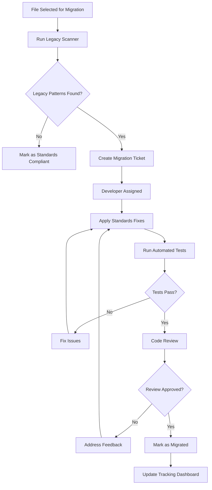

# Legacy Code Tracking and Migration Strategy

**Document Version:** 1.0  
**Effective Date:** July 23, 2025  
**Owner:** Technical Lead (Alan Safahi)  
**Scope:** SoapBox Super App Legacy Code Migration  

---

## Overview

This document outlines the systematic approach for identifying, tracking, and migrating legacy code patterns to align with the new SoapBox Development Standards. The strategy ensures gradual, risk-free migration while maintaining system stability.

---

## Legacy Code Categories

### 1. Naming Convention Violations

#### Database-Frontend Field Mapping Issues (HIGH PRIORITY)
```typescript
// LEGACY PATTERN (flagged for migration)
❌ Manual field mapping scattered throughout codebase
const userData = {
  userId: dbUser.user_id,        // Manual transformation
  createdAt: dbUser.created_at,  // Manual transformation
  isPublic: dbUser.is_public     // Manual transformation
};

// TARGET PATTERN (new standard)
✅ Centralized field mapping service
import { mapUserToApi } from '@/lib/field-mapping';
const userData = mapUserToApi(dbUser);
```

**Tracking Status:**
- **Files Affected:** ~30 components, 15 API endpoints
- **Migration Priority:** Critical (Phase 2)
- **Estimated Effort:** 6 hours
- **Risk Level:** Medium

#### API Endpoint Inconsistencies (HIGH PRIORITY)
```typescript
// LEGACY PATTERNS (flagged for migration)
❌ '/api/soap/save'              // simple lowercase
❌ '/api/users/:id'              // simple lowercase  
❌ '/api/checkIns'               // camelCase in URL

// TARGET PATTERNS (new standard)
✅ '/api/soap-entries/save'      // kebab-case
✅ '/api/user-profiles/:id'      // kebab-case
✅ '/api/check-ins'              // kebab-case
```

**Tracking Status:**
- **Files Affected:** ~25 API endpoints, 40+ frontend calls
- **Migration Priority:** Critical (Phase 2)
- **Estimated Effort:** 6 hours
- **Risk Level:** Medium

### 2. Component Structure Violations

#### Default Export Inconsistencies (MEDIUM PRIORITY)
```typescript
// LEGACY PATTERN (flagged for migration)
❌ export default function HomePage() {}

// TARGET PATTERN (new standard)
✅ export function HomePage() {}
```

**Tracking Status:**
- **Files Affected:** ~15 components
- **Migration Priority:** Medium (Phase 3)
- **Estimated Effort:** 2 hours
- **Risk Level:** Low

#### Missing TypeScript Interfaces (MEDIUM PRIORITY)
```typescript
// LEGACY PATTERN (flagged for migration)
❌ function CommentDialog(props: any) {}

// TARGET PATTERN (new standard)
✅ interface CommentDialogProps {
     postId: number;
     isOpen: boolean;
     onClose: () => void;
   }
   function CommentDialog({ postId, isOpen, onClose }: CommentDialogProps) {}
```

**Tracking Status:**
- **Files Affected:** ~8 components
- **Migration Priority:** Medium (Phase 3)
- **Estimated Effort:** 3 hours
- **Risk Level:** Low

### 3. Code Quality Issues

#### Raw SQL Usage (LOW PRIORITY)
```typescript
// LEGACY PATTERN (flagged for migration)
❌ const result = await db.execute(sql`SELECT user_id FROM users WHERE id = ${id}`);

// TARGET PATTERN (new standard)
✅ const user = await db.select().from(users).where(eq(users.id, id));
```

**Tracking Status:**
- **Files Affected:** ~5 database methods
- **Migration Priority:** Low (Phase 4)
- **Estimated Effort:** 2 hours
- **Risk Level:** Low

---

## Automated Legacy Code Detection

### 1. ESLint Rules for Legacy Pattern Detection

#### Custom ESLint Configuration
```json
// .eslintrc-legacy-detection.json
{
  "rules": {
    // Detect manual field mapping
    "soapbox/no-manual-field-mapping": {
      "create": function(context) {
        return {
          "Property[key.name=/user_id|created_at|is_public/]": function(node) {
            context.report({
              node,
              message: "🚨 LEGACY: Use centralized field mapping instead of manual transformation"
            });
          }
        };
      }
    },
    
    // Detect non-kebab-case API endpoints
    "soapbox/api-kebab-case": {
      "create": function(context) {
        return {
          "Literal[value=/^\\/api\\//]": function(node) {
            const url = node.value;
            if (url.includes('_') || /[A-Z]/.test(url.slice(5))) {
              context.report({
                node,
                message: "🚨 LEGACY: API endpoint should use kebab-case: " + url
              });
            }
          }
        };
      }
    },
    
    // Detect default exports in components
    "soapbox/no-default-component-exports": {
      "create": function(context) {
        return {
          "ExportDefaultDeclaration[declaration.type='FunctionDeclaration']": function(node) {
            const filename = context.getFilename();
            if (filename.includes('/components/') && filename.endsWith('.tsx')) {
              context.report({
                node,
                message: "🚨 LEGACY: Use named exports for components"
              });
            }
          }
        };
      }
    }
  }
}
```

### 2. Legacy Pattern Scanner Script

#### automated-legacy-scanner.js
```javascript
#!/usr/bin/env node
const fs = require('fs');
const path = require('path');
const glob = require('glob');

class LegacyPatternScanner {
  constructor() {
    this.violations = {
      naming: [],
      components: [],
      api: [],
      database: []
    };
  }

  async scanCodebase() {
    console.log('🔍 Scanning SoapBox codebase for legacy patterns...\n');
    
    await this.scanNamingViolations();
    await this.scanComponentViolations();
    await this.scanApiViolations();
    await this.scanDatabaseViolations();
    
    this.generateReport();
  }

  async scanNamingViolations() {
    const files = glob.sync('**/*.{ts,tsx}', { 
      ignore: ['node_modules/**', 'dist/**'] 
    });
    
    for (const file of files) {
      const content = fs.readFileSync(file, 'utf8');
      
      // Check for manual field mapping
      const manualMappingRegex = /(\w+):\s*\w+\.(user_id|created_at|is_public)/g;
      let match;
      while ((match = manualMappingRegex.exec(content)) !== null) {
        this.violations.naming.push({
          file,
          line: this.getLineNumber(content, match.index),
          issue: 'Manual field mapping detected',
          pattern: match[0],
          suggestion: 'Use mapUserToApi() or similar mapping function'
        });
      }
    }
  }

  async scanApiViolations() {
    const files = glob.sync('**/*.{ts,tsx}', { 
      ignore: ['node_modules/**', 'dist/**'] 
    });
    
    for (const file of files) {
      const content = fs.readFileSync(file, 'utf8');
      
      // Check for non-kebab-case API endpoints
      const apiRegex = /['"`]\/api\/([^'"`\s]+)['"`]/g;
      let match;
      while ((match = apiRegex.exec(content)) !== null) {
        const endpoint = match[1];
        if (endpoint.includes('_') || /[A-Z]/.test(endpoint)) {
          this.violations.api.push({
            file,
            line: this.getLineNumber(content, match.index),
            issue: 'Non-kebab-case API endpoint',
            pattern: match[0],
            suggestion: this.suggestKebabCase(endpoint)
          });
        }
      }
    }
  }

  async scanComponentViolations() {
    const componentFiles = glob.sync('client/src/components/**/*.tsx');
    
    for (const file of componentFiles) {
      const content = fs.readFileSync(file, 'utf8');
      
      // Check for default exports
      if (content.includes('export default function')) {
        this.violations.components.push({
          file,
          line: this.getLineNumber(content, content.indexOf('export default')),
          issue: 'Default export in component',
          pattern: 'export default function',
          suggestion: 'Use named export: export function ComponentName()'
        });
      }
      
      // Check for missing prop interfaces
      if (content.includes('props: any') || content.includes('(props)')) {
        this.violations.components.push({
          file,
          line: this.getLineNumber(content, content.indexOf('props')),
          issue: 'Missing TypeScript props interface',
          pattern: 'props: any or untyped props',
          suggestion: 'Create interface ComponentNameProps and type props'
        });
      }
    }
  }

  async scanDatabaseViolations() {
    const serverFiles = glob.sync('server/**/*.ts');
    
    for (const file of serverFiles) {
      const content = fs.readFileSync(file, 'utf8');
      
      // Check for raw SQL usage
      const rawSqlRegex = /sql`[^`]+`/g;
      let match;
      while ((match = rawSqlRegex.exec(content)) !== null) {
        this.violations.database.push({
          file,
          line: this.getLineNumber(content, match.index),
          issue: 'Raw SQL query detected',
          pattern: match[0].substring(0, 50) + '...',
          suggestion: 'Use Drizzle ORM query builder instead'
        });
      }
    }
  }

  generateReport() {
    const totalViolations = Object.values(this.violations).reduce((sum, arr) => sum + arr.length, 0);
    
    console.log('📊 LEGACY CODE SCAN RESULTS\n');
    console.log(`Total violations found: ${totalViolations}\n`);
    
    // Naming violations
    if (this.violations.naming.length > 0) {
      console.log('🔤 NAMING CONVENTION VIOLATIONS:', this.violations.naming.length);
      this.violations.naming.forEach((v, i) => {
        console.log(`  ${i + 1}. ${v.file}:${v.line} - ${v.issue}`);
        console.log(`     Pattern: ${v.pattern}`);
        console.log(`     Fix: ${v.suggestion}\n`);
      });
    }
    
    // API violations
    if (this.violations.api.length > 0) {
      console.log('🌐 API ENDPOINT VIOLATIONS:', this.violations.api.length);
      this.violations.api.forEach((v, i) => {
        console.log(`  ${i + 1}. ${v.file}:${v.line} - ${v.issue}`);
        console.log(`     Current: ${v.pattern}`);
        console.log(`     Fix: ${v.suggestion}\n`);
      });
    }
    
    // Component violations
    if (this.violations.components.length > 0) {
      console.log('⚛️ COMPONENT VIOLATIONS:', this.violations.components.length);
      this.violations.components.forEach((v, i) => {
        console.log(`  ${i + 1}. ${v.file}:${v.line} - ${v.issue}`);
        console.log(`     Fix: ${v.suggestion}\n`);
      });
    }
    
    // Database violations
    if (this.violations.database.length > 0) {
      console.log('🗄️ DATABASE VIOLATIONS:', this.violations.database.length);
      this.violations.database.forEach((v, i) => {
        console.log(`  ${i + 1}. ${v.file}:${v.line} - ${v.issue}`);
        console.log(`     Pattern: ${v.pattern}`);
        console.log(`     Fix: ${v.suggestion}\n`);
      });
    }
    
    // Generate JSON report for tracking
    const report = {
      timestamp: new Date().toISOString(),
      totalViolations,
      violations: this.violations,
      summary: {
        naming: this.violations.naming.length,
        api: this.violations.api.length,
        components: this.violations.components.length,
        database: this.violations.database.length
      }
    };
    
    fs.writeFileSync('legacy-code-report.json', JSON.stringify(report, null, 2));
    console.log('💾 Report saved to legacy-code-report.json');
    
    // Generate migration tickets
    this.generateMigrationTickets(report);
  }

  generateMigrationTickets(report) {
    const tickets = [];
    
    // High priority tickets
    if (report.violations.naming.length > 0) {
      tickets.push({
        priority: 'HIGH',
        title: `Migrate ${report.violations.naming.length} manual field mapping instances`,
        description: 'Replace manual field transformations with centralized mapping service',
        effort: Math.ceil(report.violations.naming.length * 0.2) + ' hours',
        phase: 'Phase 2'
      });
    }
    
    if (report.violations.api.length > 0) {
      tickets.push({
        priority: 'HIGH',
        title: `Standardize ${report.violations.api.length} API endpoints to kebab-case`,
        description: 'Update API endpoints and frontend calls to use consistent kebab-case naming',
        effort: Math.ceil(report.violations.api.length * 0.15) + ' hours',
        phase: 'Phase 2'
      });
    }
    
    // Medium priority tickets
    if (report.violations.components.length > 0) {
      tickets.push({
        priority: 'MEDIUM',
        title: `Fix ${report.violations.components.length} component export patterns`,
        description: 'Update default exports to named exports and add TypeScript interfaces',
        effort: Math.ceil(report.violations.components.length * 0.2) + ' hours',
        phase: 'Phase 3'
      });
    }
    
    // Low priority tickets
    if (report.violations.database.length > 0) {
      tickets.push({
        priority: 'LOW',
        title: `Migrate ${report.violations.database.length} raw SQL queries to ORM`,
        description: 'Replace raw SQL with Drizzle ORM query builder patterns',
        effort: Math.ceil(report.violations.database.length * 0.4) + ' hours',
        phase: 'Phase 4'
      });
    }
    
    fs.writeFileSync('migration-tickets.json', JSON.stringify(tickets, null, 2));
    console.log('🎫 Migration tickets generated in migration-tickets.json');
  }

  getLineNumber(content, index) {
    return content.substring(0, index).split('\n').length;
  }

  suggestKebabCase(endpoint) {
    return endpoint
      .replace(/([A-Z])/g, '-$1')
      .replace(/_/g, '-')
      .toLowerCase()
      .replace(/^-/, '');
  }
}

// Run the scanner
const scanner = new LegacyPatternScanner();
scanner.scanCodebase().catch(console.error);
```

### 3. Git Hook Integration

#### pre-commit-legacy-check.sh
```bash
#!/bin/bash
echo "🔍 Checking for legacy patterns..."

# Run legacy pattern scanner on staged files
STAGED_FILES=$(git diff --cached --name-only --diff-filter=ACM | grep -E '\.(ts|tsx)$')

if [ -z "$STAGED_FILES" ]; then
  echo "✅ No TypeScript files staged"
  exit 0
fi

# Check for legacy patterns in staged files
LEGACY_VIOLATIONS=0

for file in $STAGED_FILES; do
  # Check for manual field mapping
  if grep -q "user_id\|created_at\|is_public" "$file"; then
    echo "⚠️  Legacy field mapping detected in $file"
    echo "   Consider using centralized field mapping service"
    LEGACY_VIOLATIONS=$((LEGACY_VIOLATIONS + 1))
  fi
  
  # Check for non-kebab-case API endpoints
  if grep -q "'/api/[^']*[A-Z_]" "$file"; then
    echo "⚠️  Non-kebab-case API endpoint detected in $file"
    echo "   Use kebab-case for API endpoints"
    LEGACY_VIOLATIONS=$((LEGACY_VIOLATIONS + 1))
  fi
  
  # Check for default exports in components
  if [[ "$file" == *"/components/"* ]] && grep -q "export default function" "$file"; then
    echo "⚠️  Default export detected in component $file"
    echo "   Use named exports for components"
    LEGACY_VIOLATIONS=$((LEGACY_VIOLATIONS + 1))
  fi
done

if [ $LEGACY_VIOLATIONS -gt 0 ]; then
  echo ""
  echo "🚨 Found $LEGACY_VIOLATIONS legacy pattern(s)"
  echo "💡 These patterns are discouraged but not blocking"
  echo "📚 See SoapBox Development Standards for guidance"
  echo ""
  echo "Continue with commit? [y/N]"
  read -r response
  case "$response" in
    [yY][eE][sS]|[yY]) 
      echo "✅ Proceeding with commit (legacy patterns noted)"
      ;;
    *)
      echo "❌ Commit cancelled - please address legacy patterns"
      exit 1
      ;;
  esac
else
  echo "✅ No legacy patterns detected"
fi
```

---

## Legacy Code Tracking Dashboard

### 1. Migration Progress Tracking

#### legacy-migration-tracker.json
```json
{
  "lastScan": "2025-07-23T10:00:00Z",
  "totalLegacyFiles": 48,
  "migrationProgress": {
    "phase1": {
      "status": "completed",
      "completedFiles": 4,
      "totalFiles": 4,
      "completionRate": "100%"
    },
    "phase2": {
      "status": "in-progress",
      "completedFiles": 0,
      "totalFiles": 25,
      "completionRate": "0%",
      "targetFiles": [
        "server/routes.ts",
        "client/src/components/SocialFeed.tsx",
        "client/src/components/CommentDialog.tsx"
      ]
    },
    "phase3": {
      "status": "pending",
      "completedFiles": 0,
      "totalFiles": 15,
      "completionRate": "0%"
    },
    "phase4": {
      "status": "pending",
      "completedFiles": 0,
      "totalFiles": 5,
      "completionRate": "0%"
    }
  },
  "violationsByCategory": {
    "naming": 18,
    "api": 12,
    "components": 8,
    "database": 3
  },
  "riskAssessment": {
    "high": 12,
    "medium": 8,
    "low": 3
  }
}
```

### 2. Real-time Migration Status

#### migration-status-dashboard.tsx
```typescript
// Component for tracking migration progress
import React from 'react';
import { Card, CardContent, CardHeader, CardTitle } from '@/components/ui/card';
import { Progress } from '@/components/ui/progress';

interface MigrationStatus {
  phase: string;
  status: 'completed' | 'in-progress' | 'pending';
  completedFiles: number;
  totalFiles: number;
  completionRate: string;
}

export function MigrationStatusDashboard() {
  const [migrationData, setMigrationData] = React.useState<MigrationStatus[]>([]);

  React.useEffect(() => {
    // Load migration status from tracking file
    fetch('/api/migration/status')
      .then(res => res.json())
      .then(data => setMigrationData(data.phases));
  }, []);

  return (
    <div className="space-y-6">
      <h2 className="text-2xl font-bold">Legacy Code Migration Status</h2>
      
      {migrationData.map((phase) => (
        <Card key={phase.phase}>
          <CardHeader>
            <CardTitle className="flex justify-between">
              <span>{phase.phase}</span>
              <span className={`px-2 py-1 rounded text-sm ${
                phase.status === 'completed' ? 'bg-green-100 text-green-800' :
                phase.status === 'in-progress' ? 'bg-yellow-100 text-yellow-800' :
                'bg-gray-100 text-gray-800'
              }`}>
                {phase.status}
              </span>
            </CardTitle>
          </CardHeader>
          <CardContent>
            <div className="space-y-2">
              <Progress 
                value={(phase.completedFiles / phase.totalFiles) * 100} 
                className="w-full"
              />
              <p className="text-sm text-gray-600">
                {phase.completedFiles} of {phase.totalFiles} files migrated
              </p>
            </div>
          </CardContent>
        </Card>
      ))}
    </div>
  );
}
```

---

## Incremental Migration Strategy

### 1. File-by-File Migration Approach

#### Migration Workflow


### 2. Prioritization Matrix

#### Migration Priority Scoring
```typescript
interface LegacyFile {
  path: string;
  violationCount: number;
  violationType: 'naming' | 'api' | 'component' | 'database';
  riskLevel: 'high' | 'medium' | 'low';
  touchFrequency: number; // Git commits in last 90 days
  businessCriticality: number; // 1-10 scale
}

function calculateMigrationPriority(file: LegacyFile): number {
  const weights = {
    violationCount: 0.3,
    riskLevel: 0.25,
    touchFrequency: 0.25,
    businessCriticality: 0.2
  };

  const riskScore = file.riskLevel === 'high' ? 10 : 
                   file.riskLevel === 'medium' ? 6 : 3;

  return (
    file.violationCount * weights.violationCount +
    riskScore * weights.riskLevel +
    file.touchFrequency * weights.touchFrequency +
    file.businessCriticality * weights.businessCriticality
  );
}
```

### 3. Batch Migration Strategy

#### Weekly Migration Targets
```json
{
  "week1": {
    "target": "High-priority naming violations",
    "files": 8,
    "estimatedHours": 4,
    "assignee": "Senior Developer"
  },
  "week2": {
    "target": "API endpoint standardization",
    "files": 12,
    "estimatedHours": 6,
    "assignee": "Full Stack Developer"
  },
  "week3": {
    "target": "Component export patterns",
    "files": 6,
    "estimatedHours": 3,
    "assignee": "Frontend Developer"
  },
  "week4": {
    "target": "Database query optimization",
    "files": 3,
    "estimatedHours": 2,
    "assignee": "Backend Developer"
  }
}
```

---

## Reporting and Metrics

### 1. Daily Migration Report

#### daily-migration-report.md template
```markdown
# Daily Migration Report - [Date]

## Progress Summary
- **Files Migrated Today:** X
- **Total Files Remaining:** Y
- **Overall Progress:** Z%
- **Current Phase:** Phase N

## Today's Completions
- [ ] `/path/to/file1.tsx` - Naming conventions fixed
- [ ] `/path/to/file2.ts` - API endpoints standardized
- [ ] `/path/to/file3.tsx` - Component exports updated

## Blockers and Issues
- Issue 1: Description and resolution plan
- Issue 2: Description and escalation needed

## Tomorrow's Targets
- Target 1: Specific files and scope
- Target 2: Specific files and scope

## Metrics
- **Violation Reduction:** Before: X → After: Y
- **Standards Compliance:** N%
- **Time Spent:** X hours
```

### 2. Weekly Success Metrics

#### Key Performance Indicators
```typescript
interface WeeklyMigrationMetrics {
  filesProcessed: number;
  violationsFixed: number;
  complianceImprovement: number; // percentage points
  developerProductivity: number; // story points or commits
  codeQualityScore: number; // ESLint + TypeScript score
  migrationVelocity: number; // files per week
  
  breakdown: {
    naming: { fixed: number; remaining: number };
    api: { fixed: number; remaining: number };
    components: { fixed: number; remaining: number };
    database: { fixed: number; remaining: number };
  };
}
```

---

## Conclusion

This legacy code tracking system provides comprehensive visibility into migration progress while ensuring systematic, risk-managed adoption of SoapBox Development Standards. The combination of automated detection, prioritized migration, and continuous tracking ensures steady progress toward full compliance.

**Key Benefits:**
- **Automated Detection:** Identifies legacy patterns without manual review
- **Risk-Based Prioritization:** Focuses on high-impact files first
- **Progress Tracking:** Clear visibility into migration status
- **Developer Guidance:** Specific fixes and improvement suggestions
- **Compliance Monitoring:** Continuous measurement of standards adoption

**Success Criteria:**
- 100% of high-priority files migrated within 4 weeks
- 90%+ standards compliance score achieved
- Zero new legacy pattern introductions
- Sustained developer productivity during migration

---

**Document Status:** READY FOR IMPLEMENTATION  
**Next Update:** Weekly during migration period  
**Owner:** Technical Lead (Alan Safahi)